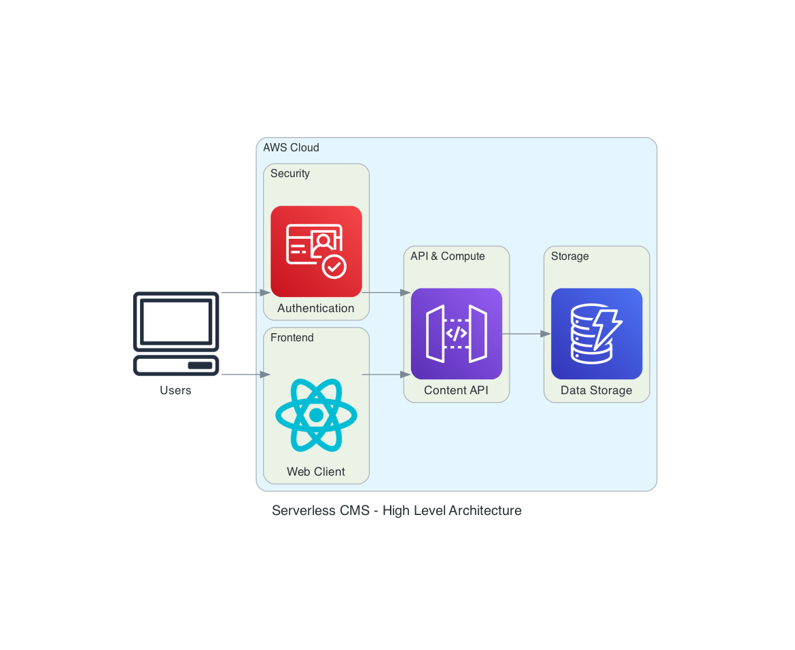
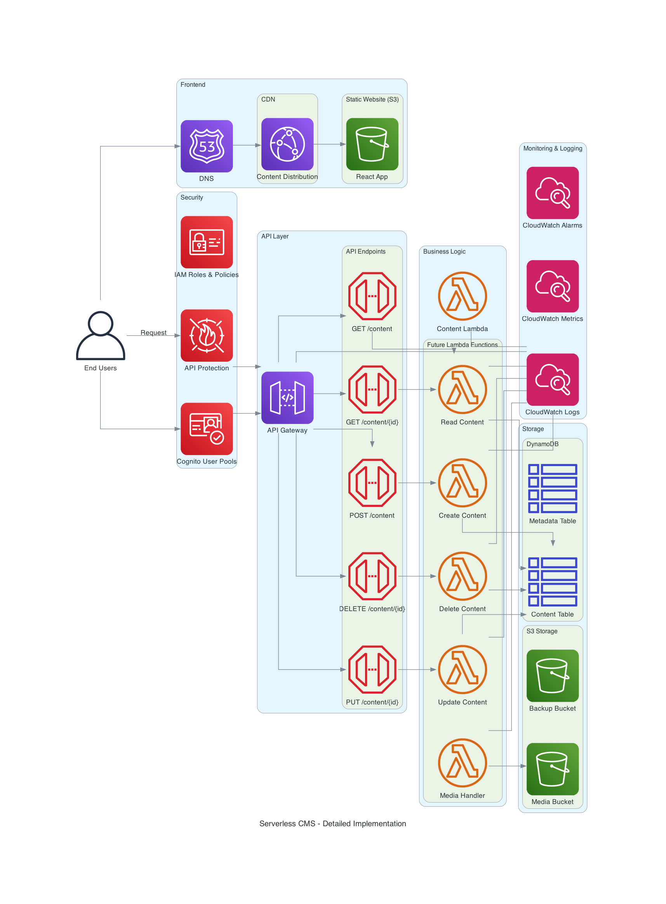

# Serverless Content Management System (CMS) on AWS

## Overview

This project is a scalable, cost-effective Content Management System (CMS) built using AWS serverless technologies. The CMS exposes a RESTful API for managing and retrieving content, making it suitable for websites, apps, and other digital platforms.

---

## Architecture Diagrams

### High Level Architecture

### Service Level Architecture

### Detailed Implementation

---

## Features

- **API-driven**: All content operations (CRUD) are performed via a secure API.
- **Serverless**: Utilizes AWS Lambda, API Gateway, DynamoDB, and S3 for a fully managed, pay-as-you-go architecture.
- **Scalable**: Automatically scales with demand.
- **Secure**: Supports authentication and authorization (e.g., via AWS Cognito).
- **Extensible**: Easily add new content types or endpoints.

---

## Architecture

- **API Gateway**: Exposes RESTful endpoints for content operations.
- **AWS Lambda**: Handles business logic for each API endpoint.
- **DynamoDB**: Stores structured content (e.g., articles, metadata).
- **S3**: Stores unstructured content (e.g., images, files).
- **Cognito**: (Optional) Manages user authentication and authorization.
- **CloudFormation/SAM/CDK**: Infrastructure as Code for repeatable deployments.

---

## Project Plan

### 1. Requirements & Design

- Define content types and data models (e.g., articles, pages, media).
- Design API endpoints (e.g., `GET /content/{id}`, `POST /content`).
- Plan authentication/authorization strategy.

### 2. Infrastructure Setup

- Set up AWS account and IAM roles.
- Define infrastructure using AWS SAM, CDK, or CloudFormation.

### 3. API Development

- Create API Gateway REST API.
- Implement Lambda functions for:
  - Creating content
  - Retrieving content
  - Updating content
  - Deleting content
- Integrate Lambda with DynamoDB and S3.

### 4. Data Storage

- Design DynamoDB tables for content metadata.
- Set up S3 buckets for media storage.

### 5. Security

- Implement authentication (e.g., Cognito).
- Set up IAM roles and policies for least-privilege access.
- Enable API Gateway authorization.

### 6. Testing

- Write unit and integration tests for Lambda functions.
- Test API endpoints using tools like Postman.

### 7. Deployment

- Automate deployment with CI/CD (e.g., GitHub Actions, CodePipeline).
- Document deployment steps.

### 8. Documentation

- Document API endpoints (OpenAPI/Swagger).
- Provide usage examples.

### 9. Monitoring & Logging

- Enable CloudWatch logging for Lambda and API Gateway.
- Set up alarms for errors and performance issues.

---

## Example API Endpoints

- `GET /content/{id}` – Retrieve content by ID
- `POST /content` – Create new content
- `PUT /content/{id}` – Update content
- `DELETE /content/{id}` – Delete content
- `GET /content` – List content (with filters)

---

## Getting Started

1. Clone the repository.
2. Install dependencies.
3. Deploy the stack using your chosen IaC tool.
4. Use the provided API endpoints to manage content.

---

## Next Steps

Now that the basic serverless CMS infrastructure is in place and tested, here are the next development priorities:

### 1. Enhance Lambda Implementation
- Implement actual CRUD operations with DynamoDB
  - Add proper data validation
  - Add error handling
  - Implement pagination for list endpoints
- Create separate Lambda functions for different operations
- Add support for content versioning

### 2. Authentication & Authorization
- Implement AWS Cognito for user management
  - Set up user pools and identity pools
  - Configure user groups and roles
- Add JWT authentication to API Gateway
- Implement fine-grained access control for different content types

### 3. Media Management
- Enhance S3 integration for media files
  - Implement secure upload/download flows
  - Add media optimization (resizing, compression)
  - Support for metadata and tagging
- Create dedicated media endpoints

### 4. Admin Interface
- Develop a web-based admin dashboard
  - Content creation and management UI
  - User and permission management
  - Media library
- Host on S3 with CloudFront distribution

### 5. CI/CD Pipeline
- Set up GitHub Actions or AWS CodePipeline
  - Automated testing
  - Automated deployment to staging/production
  - Infrastructure validation

### 6. Enhanced Monitoring
- Add detailed CloudWatch metrics and dashboards
- Set up alerting for performance issues and errors
- Implement distributed tracing with AWS X-Ray

---

## Contributing

Contributions are welcome! Please open issues or submit pull requests.

---

## License

MIT License 