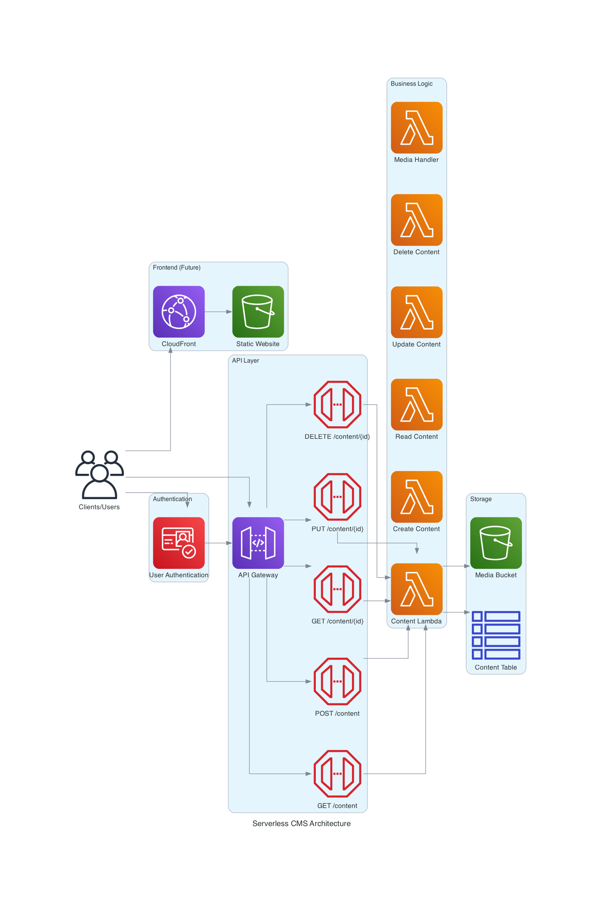
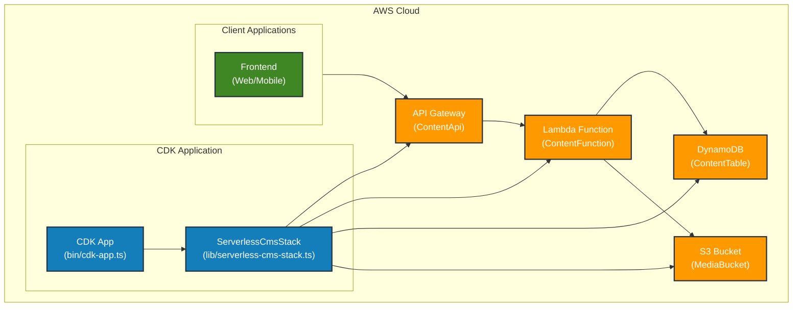

# Serverless CMS Architecture

## Overview

This document describes the architecture of the Serverless CMS system built on AWS. The architecture is designed for scalability, reliability, and cost-effectiveness.

## Diagram

## Components

### Client Layer

- **Clients/Users**: End users who interact with the CMS through a web browser or API client
- **API Test Page**: HTML/JS client for testing the API and performing CRUD operations

### API Layer

- **API Gateway**: Manages API endpoints and routes requests to appropriate Lambda functions
- **Endpoints**: 
  - `GET /content` - List all content
  - `POST /content` - Create new content
  - `GET /content/{id}` - Get content by ID
  - `PUT /content/{id}` - Update content
  - `DELETE /content/{id}` - Delete content

### Business Logic

- **Content Lambda**: A Node.js Lambda function that handles all content operations
  - Implemented with full CRUD (Create, Read, Update, Delete) functionality
  - Routes requests based on HTTP method and path parameters
  - Processes input validation and error handling
  - Interacts with DynamoDB for data persistence
  - Returns standardized API responses

### Storage

- **Content Table**: DynamoDB table that stores content data
  - Primary key: `id` (UUID)
  - Stores content metadata, text, and timestamps
  - Supports high-performance read/write operations
  - On-demand capacity for automatic scaling

- **Media Bucket**: S3 bucket for storing media files (future implementation)

### Authentication (Future)

- **User Authentication**: AWS Cognito for managing users and authentication

### Frontend (Future & Current)

- **CloudFront**: CDN for content delivery
- **Static Website**: S3-hosted web application for content management
- **API Test Page**: Implemented HTML/JS client for testing the API

## Architecture Benefits

1. **Serverless**: No server management needed
2. **Pay-per-use**: Cost based on actual usage
3. **Scalable**: Automatically scales with traffic
4. **Secure**: IAM roles and policies for fine-grained security
5. **Resilient**: Built on AWS managed services
6. **Low latency**: Global CDN distribution

## Implementation Status

- ✅ API Gateway configuration
- ✅ Lambda function with CRUD operations
- ✅ DynamoDB table for content storage
- ✅ API Test Page for interactive testing
- ⬜ S3 Media storage integration
- ⬜ Authentication with Cognito
- ⬜ Admin frontend application

## Architecture Description

This diagram illustrates the architecture of the Serverless CMS application built with AWS CDK:

1. **CDK Application**:
   - The entry point is `bin/cdk-app.ts`, which initializes the CDK app
   - The main infrastructure is defined in `ServerlessCmsStack`

2. **AWS Components**:
   - **API Gateway**: Exposes RESTful endpoints for content management
   - **Lambda Function**: Handles API requests and content operations
   - **DynamoDB**: Stores content data
   - **S3 Bucket**: Stores media files

3. **Client Applications**: Web or mobile applications that consume the API

The application follows a serverless architecture pattern, where all infrastructure is managed by AWS and scales automatically. 