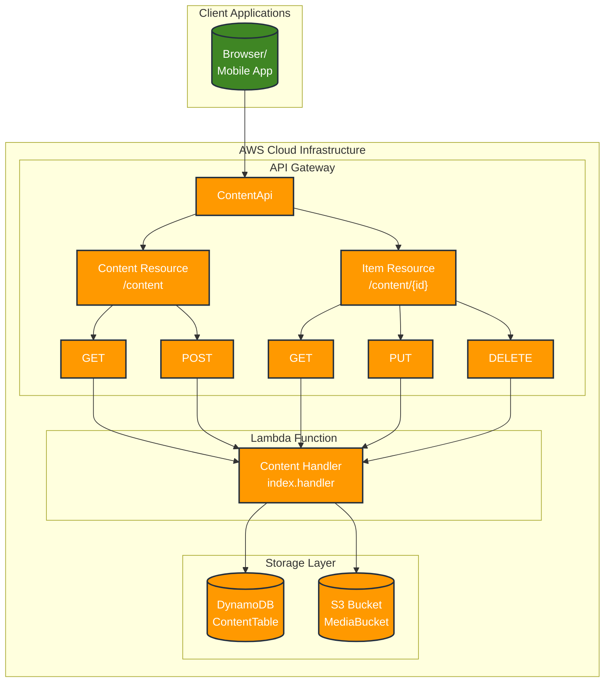

# Serverless CMS - Detailed Architecture

## Data Flow

1. **Client** makes requests to the API Gateway endpoints:
   - `GET /content` - List all content items
   - `POST /content` - Create a new content item
   - `GET /content/{id}` - Retrieve a specific content item
   - `PUT /content/{id}` - Update a specific content item
   - `DELETE /content/{id}` - Delete a specific content item

2. **API Gateway** routes these requests to the Lambda function

3. **Lambda Function** processes the requests:
   - Parses the incoming event
   - Determines the operation based on HTTP method and path parameters
   - Performs validation on inputs
   - Executes the appropriate CRUD operation
   - Returns a standardized response

4. **DynamoDB** stores and retrieves the content:
   - Content is stored in a table with a primary key of `id`
   - Each item contains title, content, author, and timestamps
   - Operations are performed through the AWS SDK

5. **Response** is returned to the client:
   - Includes appropriate status code (200, 400, 404, 500)
   - Contains JSON payload with operation result
   - Provides messages to indicate success or failure

## Current Implementation Details

### API Gateway

- REST API with CORS enabled
- Routes defined for all content operations
- Integrated with single Lambda function for all operations

### Lambda Function

- Node.js 18.x runtime
- Single handler function that routes to appropriate CRUD operation
- Uses AWS SDK to interact with DynamoDB
- Implements proper error handling and validation
- Generates UUIDs for unique content identifiers
- Maintains timestamps for creation and updates

### DynamoDB

- Single table for content storage with `id` as partition key
- On-demand capacity for automatic scaling
- Stores all content metadata and text

### Client Testing

- HTML/JS client for testing the API
- Support for all CRUD operations
- Displays responses and content items
- Provides form-based interface for creating and updating content

## Future Enhancements

1. **Authentication and Authorization**
   - Implement Cognito user pools
   - Add API key validation
   - Role-based access control

2. **Media Storage**
   - S3 integration for file uploads
   - Media processing with dedicated Lambda function
   - Content type handling for various media

3. **Content Versioning**
   - Track changes to content over time
   - Support for rollbacks
   - Audit trails for content modifications

4. **Admin Interface**
   - Web-based content management interface
   - User management console
   - Analytics and reporting

This serverless architecture allows for automatic scaling based on demand without managing servers. 